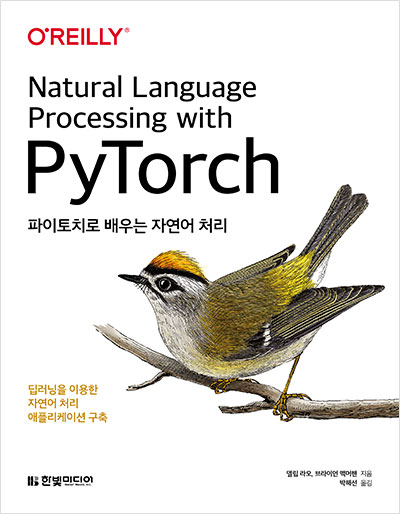
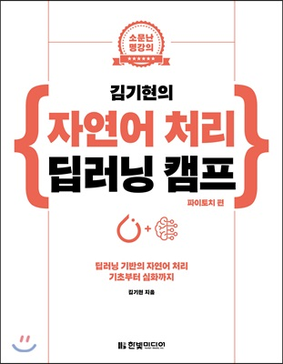

# NLP_Practice
### 

1. (참고서적) 파이토치로 배우는 자연어 처리 : 딥러닝을 이용한 자연어처리 애플리케이션 구축

### 

2. (참고서적) 김기현의 자연어처리 딥러닝 캠프 

### Soon

### BERT
### ELECTRA
### DistilBERT
### Personal Project for using BERT(+Pretraining)

### If I have a chance, I'll use GPT-2 or 3.
